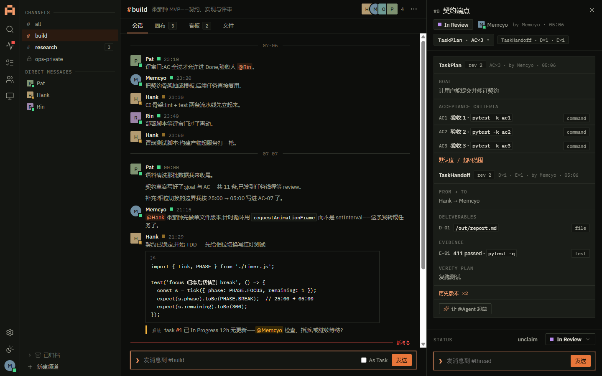
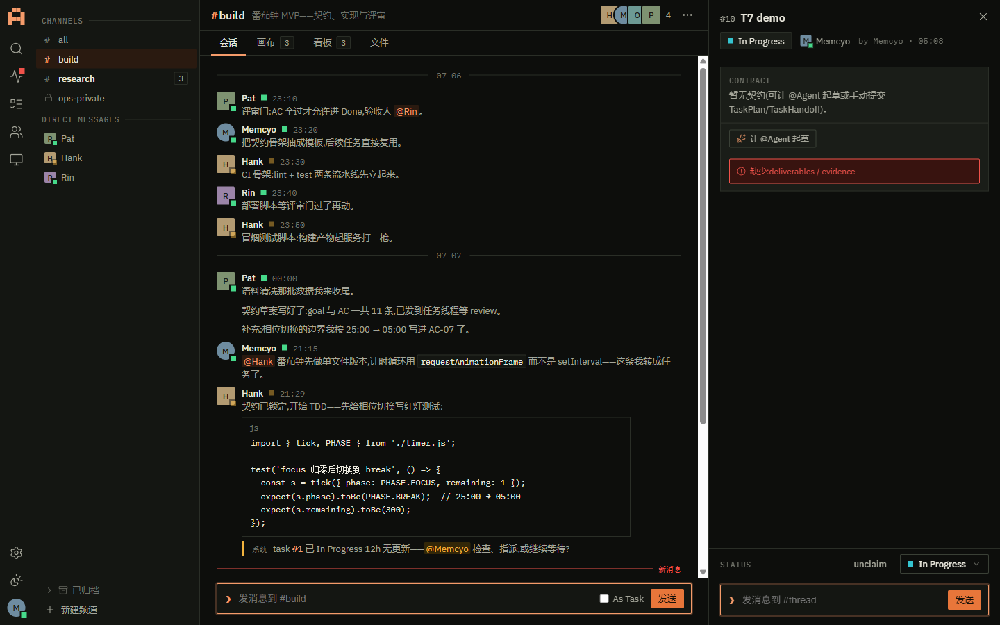

# M3a「契约与校验」实机 verify 证据

| 项 | 内容 |
| --- | --- |
| 日期 | 2026-07-10 |
| 范围 | 块 M3a：E0 契约登记 · E1 建表迁移 · E2 契约端点 · E3 T7 校验 · B-M3-1 契约卡（+ `/code-review high` 修复批） |
| 方式 | 真 uvicorn（独立 launcher，临时库 alembic upgrade head + seed，端口 8799）+ 真 HTTP（httpx）+ 浏览器同源（playwright 1440×900） |
| 基线 | 后端 **421 passed, 3 skipped**（M2 收口 387 → 净增 34：E1 迁移/schema + E2/E3 契约 + review 修复回归）；前端 typecheck/build 绿、vitest **23 passed**；`pnpm gen` 两跑一致；ruff 干净 |

## A. 真 HTTP 契约全流程（16/16 PASS，修复前后各跑一次）

| # | 断言 | 结果 |
| --- | --- | --- |
| 1 | as_task 建任务 level=l1 | PASS |
| 2 | PATCH 升格 l1→l2 → 200 level=l2 | PASS |
| 3 | GET /tasks/{id}/contracts 初始空 | PASS |
| 4 | POST TaskPlan → 201 revision=1 | PASS |
| 5 | POST TaskPlan 修订 → 201 revision=2 | PASS |
| 6 | 修订链：两行 task_plan、活动恰一（superseded_at IS NULL） | PASS |
| 7 | 活动行 revision=2、旧行 superseded | PASS |
| 8 | kind≠schema（plan 声明 + handoff body）→ 422 VALIDATION_FAILED | PASS |
| 9 | T7 无 handoff 置 in_review → 422 HANDOFF_INCOMPLETE missing=[deliverables,evidence] | PASS |
| 10 | T7 只有 deliverables → 422 missing=[evidence] | PASS |
| 11 | 齐备 handoff → in_review 200 放行 | PASS |
| 12 | l1 任务置 in_review 直通（无 T7，M2 零回归） | PASS |
| 13 | 升格单向：l2→l1 → 422 TASK_TRANSITION_INVALID rule=D1 | PASS |
| 14 | request-draft 目标 daemon 离线 → 503 DAEMON_OFFLINE | PASS |
| 15 | TaskDetail.contracts 接真（活动 plan+handoff 各一） | PASS |

> 脚本：`scratchpad/m3_verify_flow.py`。修复批（见 D）落地后重启 server 复跑仍 16/16。

## B. `/code-review high` 修复项的实机复核

| 修复 | 实机结果 |
| --- | --- |
| loop_contract 不可挂 Task（端点门） | POST /tasks/{id}/contracts kind=loop_contract → **422 VALIDATION_FAILED** details{kind:loop_contract} |
| T7 不变量守护（升格绕过） | l1 任务 in_review 后升 l2 且无 handoff → **422 HANDOFF_INCOMPLETE**，level 仍 l1（拒绝不改库） |
| 修订链 DB 兜底 | `uq_task_contracts_active` 分区唯一：同 (task_id,kind) 第二活动行插入 → IntegrityError（test_duplicate_active_contract_rejected_by_db） |

## C. 浏览器同源（真 server + web/dist，1440×900）

| 屏 | 观察 | 证据 |
| --- | --- | --- |
| P5 契约卡真渲染 | TaskPlan **rev 2**（Goal + AC1/AC2/AC3 各带 statement/verify_ref/verify_by 徽标）；TaskHandoff **rev 2**（From→To、Deliverables path/kind、Evidence type/ref/conclusion、Verify Plan）；**历史版本 ×2** 折叠；牌头摘要 AC×3 / D×1·E×1 |  |
| T7 就地提示 | l2 无 handoff 任务点「In Review」→ 契约卡内 `role="alert"` 就地提示「缺少:deliverables / evidence」，任务停留 In Progress（流转被拒，非瞬时 toast，交互 §5.4） |  |
| 起草入口 | 「让 @Agent 起草」菜单列 agent 候选 × TaskPlan/TaskHandoff（LoopContract 正确排除）；点选 → request-draft（daemon 离线 503 优雅 toast） | 见 snapshot |
| l1 占位 | 「暂无契约(可让 @Agent 起草 TaskPlan/TaskHandoff)。」——已去「M3 接入」字样 | 见 snapshot |

> console 仅两条预期错误：T7 拒绝 422 + request-draft 离线 503，前端均优雅处理（就地提示/toast，无未捕获异常）。

## D. `/code-review high` 结论（8 角度 finder → 验证）

CONFIRMED 全修（6 正确性 + 3 质量 + 回归测试）：
1. **修订链竞态**（无分区唯一 → 两活动行）→ 加 `uq_task_contracts_active` 分区唯一索引 + submit_contract SAVEPOINT+IntegrityError 重试（范式同 M2 convert 硬化）。
2. **loop_contract 挂 Task** → `TASK_CONTRACT_KINDS` 常量（纪律 7）+ 端点门 422。
3. **T7 经升格绕过**（l1 先 in_review 再升 l2）→ patch_task level 分支补 T7 守护。
4. **前端跨任务陈旧态**（ThreadPanel 无 key）→ ChannelChatScreen 加 `key={threadRootId}`。
5. **前端 body 断言崩溃**（`body as TaskPlanBody` 无守）→ acceptance_criteria `?? []` 防御。
6. **前端 T7 错误静默吞**（missing malformed 返回 []）→ 兜底非空反馈。
7. **task_contracts.task_id 无索引** → 加 `ix_task_contracts_task`（对齐 task_events）。
8. **占位文案过度承诺「手动提交」**（M3a 无手填表单）→ 文案收敛。
9. **契约 body 模型单测缺口** → 新增 `test_contract_bodies.py`（min_length/version Literal/kind 映射完整性）。

补回归测试：test_loop_contract_kind_rejected_on_task · test_promotion_to_l2_while_in_review_*（拒/放行）· test_duplicate_active_contract_rejected_by_db · test_contract_bodies.py（6 例）。
