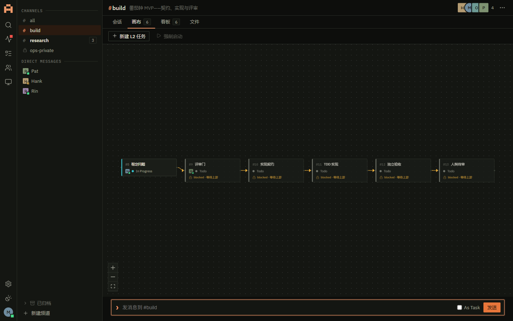
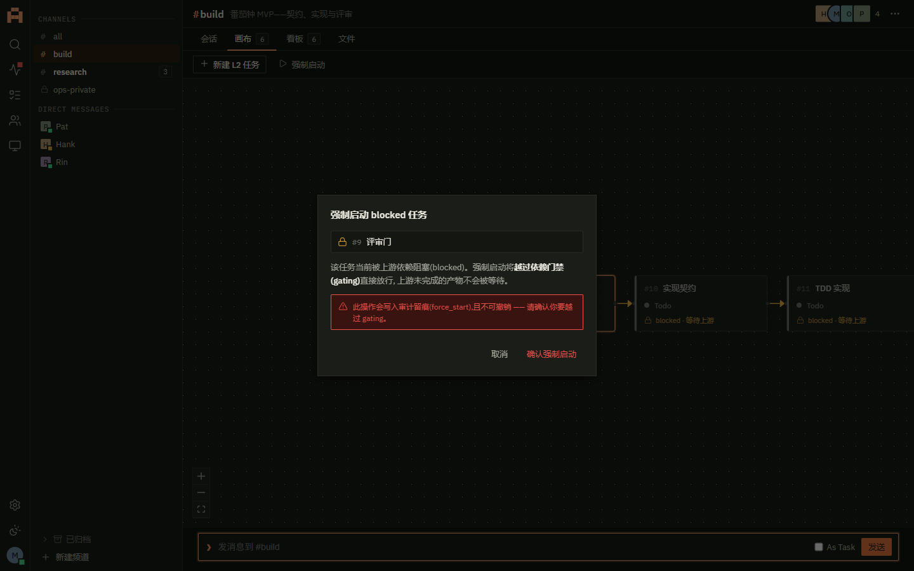
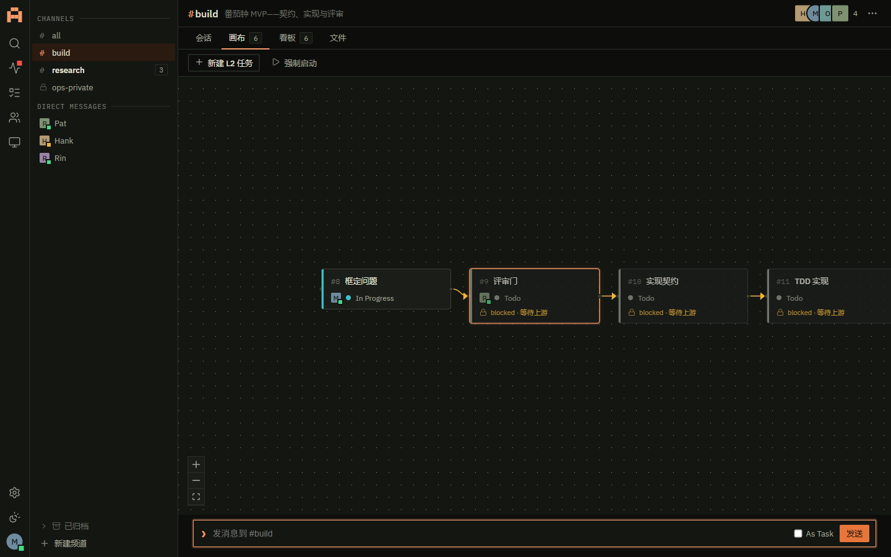
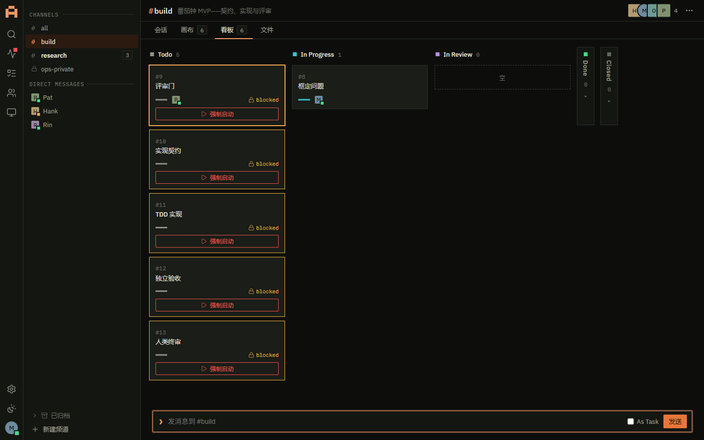
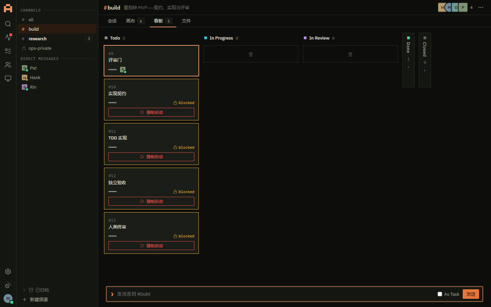
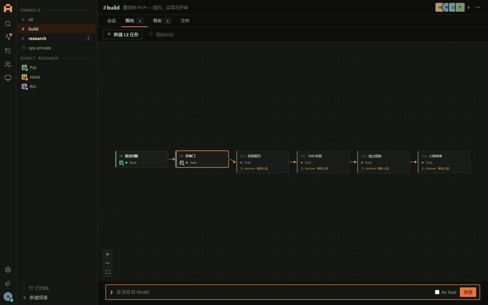

# M3b「画布与 gating」实机 verify 证据

| 项 | 内容 |
| --- | --- |
| 日期 | 2026-07-10 |
| 范围 | 块 M3b：E0b 契约+图内核 · E4 画布结构端点 · E5 blocked gating+force-start · B-M3-2 画布页签 · B-M3-3 升格/force-start UI · FTS trigram |
| 方式 | 隔离 launcher（临时库 alembic head + seed + 注入 daemon key，端口 8799）+ 真 HTTP（httpx）+ **真 websockets daemon-sim**（观测投递 gating）+ 浏览器同源（playwright 1440×900） |
| 基线 | 后端 **479 passed / 3 skipped**（M3b 前 428 → +51，零回归）；web vitest **73**（23 → +50）；pyright 0；ruff 干净；`pnpm gen` 确定空 diff；web build 绿 |

## A. 真 HTTP + daemon-sim 全流程 —— 17/17 PASS

脚本 `e6_launch.py`（真 uvicorn 8799）+ `e6_flow.py`（httpx 建 DAG + async websockets daemon-sim）。工程三角六节点 DAG：框定问题 → 评审门 → 实现契约 → TDD 实现 → 独立验收 → 人类终审。

| # | 断言 | 结果 |
| --- | --- | --- |
| 1 | GET /channels/{id}/canvas 初始空快照 | PASS |
| 2 | POST nodes ×6：agent 节点建 **L2** 任务 + 锚点系统消息（第三创建途径），baseline 0→6 | PASS |
| 3 | 6 节点均 level=l2 且 root_message_id 非空 | PASS |
| 4 | POST edges 成 5 边链 DAG | PASS |
| 5 | 成环 ⑥→① → 422 GRAPH_CYCLE | PASS |
| 6 | T7：l2 无 handoff 置 in_review → 422 HANDOFF_INCOMPLETE missing=[deliverables,evidence] | PASS |
| 7 | T7：补齐 handoff → in_review 200 放行 | PASS |
| 8 | Agent force-start → **403 rule=C3** | PASS |
| 9 | 人类 force-start → 200 且**状态不变**（todo→todo） | PASS |
| 10 | force-start 双留痕：任务线程系统消息 +1 | PASS |
| 11 | 删节点解除引用但**保任务**（C8） | PASS |
| 12 | layout PUT **不 bump 基线** | PASS |
| **13** | **G1 blocked 节点线程 @Pat → owner agent 不被唤醒**（instrs=[]） | PASS |
| **14** | **G2 上游 done 解锁 → 唤醒**（agent.wake + message.deliver） | PASS |
| **15** | **G3 force-start override → owner 被唤醒一次**（agent.wake） | PASS |
| **16** | **G3 force-start 200 无死锁**（真事件循环 `_run_sync` 直投） | PASS |
| 17 | R4/R7：blocked 任务状态写不受限（Agent claim 200） | PASS |

> daemon-sim = 真 websockets 客户端连 8799 `/api/daemon/ws`，hello 上报 Pat idle，自动 ack 收到的 instr 并记录类型。G1/G2/G3 三连在**真事件循环**上端到端复证 gating 语义（裁决 2/3），G3 顺带证实 force_start_wake 的 `_run_sync` 在真 loop 上无死锁（daemon 并发 ack 驱动直投完成）。

## B. 浏览器同源（真 server + web/dist，1440×900）

截图归档本目录：

| 屏 | 观察 | 证据 |
| --- | --- | --- |
| P2 画布 DAG | 六节点 DAG：#8 框定问题 **In Progress**（owner M）、#9–#13 **「blocked · 等待上游」** 级联徽标（前端 lib/graph.ts deriveBlocked，与 server 同 golden 判例）、5 条正交边、工具栏（新建 L2 任务 + 强制启动）、缩放/Fit 控件 |  |
| force-start 弹层 | 选中 blocked 节点 → 「强制启动」按钮由 disabled 变可点 → 二次确认弹层（P13b 危险范式）：节点 #9 + gating 越过说明 + 「写入审计留痕(force_start)，不可撤销」alert + 取消/确认 |  |
| force-start 确认 | 点「确认强制启动」→ POST force-start → 弹层关闭、成功留痕 |  |
| P3 看板 blocked | Todo 列 5 卡带 **blocked 徽标 + 强制启动按钮**（由 blockedTaskIdsFromCanvas 派生）、#8 In Progress 列 |  |
| **WS 无刷新解锁** | 独立 httpx 把 #8 推 done（handoff→in_review→done）→ **未刷新**：看板 In Progress 1→0、Done 0→1、**#9 blocked 徽标+force-start 钮实时消失**（上游 done → 实时重算解锁） |  |
| 画布实时重着色 | 切回画布：#8 done 着色、#9 解锁，WS task.updated + canvas.* 双驱动 |  |

> console：**0 error / 0 warning**（force-start / 状态推进全程无未捕获异常）。深链 `?task=`+`?node=` 双向绑定实证（点节点同步写两参）。

## C. 关键结论

- **PRD M3 出口达成**：工程三角六节点 DAG 在画布上建图 → blocked 标注与投递 gating 生效（不唤醒）→ 逐节点推进含 T7 门 → force-start 一次留痕 → 全程 WS 无刷新。
- **纪律 8 前后端图算法零漂移**：`packages/fixtures/golden/graph.json` 黄金判例，server `kernel/graph.py` 与前端 `lib/graph.ts` 双跑对照（各自单测），blocked 级联与成环预判两侧一致。
- **裁决落地实证**：blocked 不落库（实时推导）、gating 只作用投递层不限状态写（R4/R7）、force-start 不改状态不删边只留痕+本次放行——均经 daemon-sim + HTTP 双面复证。

## D. FTS trigram 中文命中结论（回写契约 A §10.4）

messages_fts 由 0005 迁移改 trigram。**trigram 有「3 字符地板」**：查询 <3 字符切不出 token，MATCH 恒空；故完整方案 = trigram MATCH（≥3 字，含连续 CJK 与中英混合，索引化 + snippet «» 高亮）+ 正文 LIKE 兜底（<3 字，手工 «» 片段）。实测：≥3 字「蟠桃闹/登录页面/录bug」走 MATCH 命中；2 字「番茄/星轨」走 LIKE 命中并附 «子串» snippet；英文内部子串 + 大小写变体命中；GET /search 三分组 + snippet 形状不变（契约 B §9.6）。

## E. OAuth 冷启动复验（M1 遗留）

本批未重新消耗完整双 Agent 真 OAuth 冷启动；gating/force-start 的 daemon 面用真 websockets daemon-sim（网关侧协议真实）复证。真双 Agent OAuth refresh 竞争依赖既有确定性单测 + M1 凭证 peer 自愈实测，结论沿用未变。
