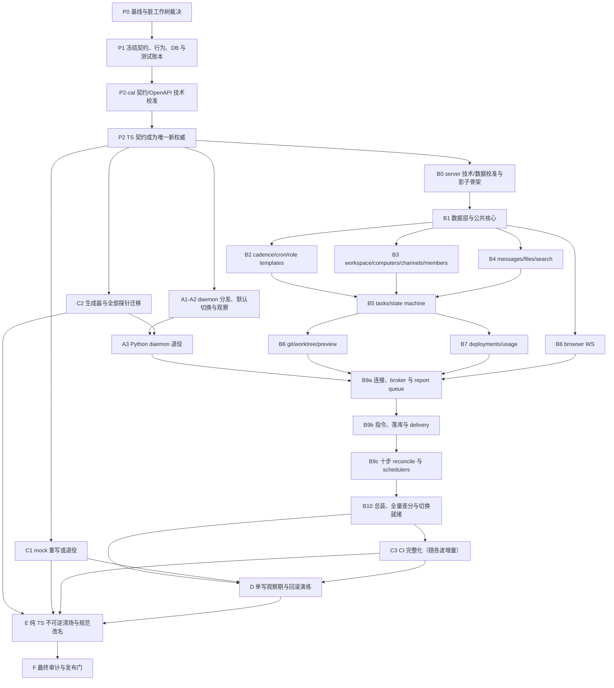

# CoAgentia 全量 TypeScript 迁移执行计划

> 版本：v1.0（owner 已批准）
> 规划日期：2026-07-20
> 规划代码基准：`54f1372`；P0 执行起点：`cee5d98`
> 批准记录：owner 2026-07-20 明确批准本计划并启动 P0
> 当前状态：P0「基线、范围和当前试验裁决」进行中
> 目标仓库：`D:\Project4work\Agenthub_7_8\coagentia`

## 0. 文档定位与裁决

本计划把 CoAgentia 从当前的 Python/TypeScript 双栈，迁移为只有 TypeScript 一套受支持实现的工程。它覆盖运行时、契约权威、数据库迁移、测试、mock、生成器、verify 探针、开发工具链、分发和当前权威文档。

现有 [`docs/project-handoffs/TS-MIGRATION-ROADMAP.md`](docs/project-handoffs/TS-MIGRATION-ROADMAP.md) 将终态定义为“TS 运行时 + Python/Pydantic 契约权威”，并预计永久保留约 22 个 `.py`；[`docs/project-handoffs/TS-DEV-PLAN.md`](docs/project-handoffs/TS-DEV-PLAN.md) 也自称开工前唯一计划事实源，但同样永久保留 Python contracts、Alembic 和 mock-server。两者都与本次“完全迁移为 TypeScript”的目标冲突。

执行本计划时，**只有本文件是迁移执行权威**，并同时 supersede 上述两份旧计划的执行地位。旧路线图、TS-DEV-PLAN 和其他 handoff 只作为历史事实、摸底数据与方案候选来源；若其命令、终态、依赖或裁决与本文件冲突，一律以本文件为准，不抹改旧文档当时的历史事实。

本计划不授权立刻删除 Python 实现、修改生产数据库或发布 npm 包。所有不可逆动作都必须等其前置验收、独立 code review、观察期和 owner gate 通过。

## 1. 目标与完成定义

### 1.1 目标终态

最终仓库应具有以下结构和责任边界：

```text
apps/
  server/         # TypeScript HTTP、browser WS、daemon WS、后台任务
  daemon/         # TypeScript 本机 daemon，构建为可分发 JS
  web/            # 现有 React/TypeScript web
  mock-server/    # 若仍有独立价值则为 TypeScript；否则完整退役
packages/
  contracts/      # TypeScript 唯一契约权威、运行时 schema、类型和常量
scripts/          # TypeScript 生成、校验和迁移工具
scratchpad/       # 仅保留仍有价值的 TypeScript 校准/实机探针
```

迁移期可使用 `apps/server-ts`、`apps/daemon-ts`、`packages/contracts-ts` 与旧实现并存；完成切换后必须恢复无 `-ts` 后缀的规范目录名，避免把“临时双轨”固化成架构。

### 1.2 纯 TS 硬性完成门

只有以下条件全部满足，才能宣布迁移完成：

1. Git 跟踪的 `.py` 为 0；根 `pyproject.toml`、`uv.lock` 已删除。
2. 所有第一方可执行源码为 `.ts`/`.tsx`。现有 23 个 `.mjs` 和 1 个 `.ps1` 必须迁为 TS 或退役；同时盘点其他可执行扩展、shebang、package `bin`、CI 内联命令和配置入口。构建生成的 JS 只存在于忽略的 `dist`/包产物中，不跟踪入库，不设第一方源码 allowlist。
3. 在 P0 声明的 Windows/CPU 支持矩阵上，hermetic core 层只需 Node/pnpm 即可安装、生成、静态检查、运行不依赖外部产品的测试和构建；原生 addon 必须命中已验证 prebuild，不得暗中要求 Python/node-gyp 工具链。
4. 产品集成层显式声明并锁定 Git 与可复现安装的浏览器；credentialed live 层另行声明已登录的 Claude/Codex CLI 与凭据。外部前提不能伪装成“仅 Node/pnpm”，但也不能成为跳过最终实机验收的理由。
5. `packages/contracts` 是 TS 唯一事实源：模型 schema 与带 `host/audience` 的 REST route/operation registry 共同派生运行时校验、静态类型、常量、JSON Schema/OpenAPI、协议目录和 fingerprint 内核；不存在由 Python 生成 TS 或手写第二份 OpenAPI 的反向/平行权威链。
6. 80 个 REST 端点、2 个 WS 端点、health、SPA fallback、browser WS 与 daemon WS 的线上行为对等。
7. 现有 SQLite 数据库可原位接管；空库和每个受支持历史 revision 都有可重复的升级证据，不能只证明“新库可运行”。
8. P0 确认的全仓 Python 测试均进入机器可校验的母账本，并有不重不漏的逐用例处置记录和等价 TS 覆盖；缺失、重复、目标测试不存在、未批准 retire 或基准集合漂移均阻断 CI，不能用新的测试总数掩盖删测。
9. 真 TS server × 真 TS daemon × 真 SQLite × 真 git × 真浏览器全链通过。
10. server 和 daemon 的安装/启动在仓库外干净目录通过；默认命令不引用源码路径、不依赖当前工作目录、不假设未发布的 npm 包已经存在。
11. Windows CI 全量守门持续通过，且每个大块的独立 code review 没有未解决的 Critical/Major 问题。
12. README 三语、`AGENTS.md`、当前 handoff、项目记录、技术选型和常用命令均反映 TS 终态；历史文档允许继续叙述 Python 历史。

建议由 `pnpm verify:pure-ts` 自动实现第 1～2 项及 Python 工具链清场的机器检查，并在 CI 中设为必过。

## 2. 当前事实基线

### 2.1 代码与测试规模

以 `HEAD 54f1372` 为规划基准：

| 范围 | Python 文件 | 当前处置 |
|---|---:|---|
| `apps/server` | 118 | 最大迁移块；影子 TS server 分十波迁移 |
| `apps/daemon` | 48 | TS 对等实现已存在，但默认入口、分发与退役尚未完成 |
| `packages/contracts` | 19 | 从 Pydantic 权威迁为 TS 权威 |
| `apps/mock-server` | 5 | TS 重写或经证据证明后退役 |
| `scripts` | 3 | 迁为 TS 生成/校验工具 |
| `scratchpad` | 23 | 活跃探针迁 TS，失效探针删除并保留结果证据 |
| **合计** | **216** | 最终必须归零 |

此外当前跟踪 23 个 `.mjs`（`packages/contracts-ts/gen.mjs` 和 `scratchpad/tscal` 校准脚本）以及 `scratchpad/run-git-calibration.ps1`。它们同样属于全量 TS 清场范围。P0 还必须扫描其他可执行扩展、shebang、package `bin`、CI/配置中的内联命令，不能只按这三种扩展做白名单式盘点。

`apps/server` 的 118 个 Python 文件在 P0 clean 执行起点 `cee5d98` 为 29,484 行，其中运行时源码 60 个/13,396 行，测试与辅助 44 个/15,388 行，Alembic 14 个/700 行。规划时记录的 29,498/15,402 含未提交 dual conformance 试验的 14 行，现已隔离，不属于 clean 基线。当前 server 具有 35 张表、13 个历史 revision、80 个 REST 端点和 2 个 WS 端点；clean server 测试为 668 个。

规划期现有生成制品的复核锚为：`build/contracts.schema.json` 237,469 bytes、224 个顶层模型、271 个 `$defs`；`build/openapi.json` 为 65 paths、82 operations，其中 80 个是 product server operation，2 个是 mock-control `POST /__mock/play` 与 `POST /__mock/reset`，且当前由 Python mock app 导出。这些数字只用于 P1 检测漏项或意外漂移，P0/P1 必须在已裁决工作树重新生成并记录精确值，不能把规划期缓存当最终权威。

旧路线图最后记录的全仓绿线为 981 collected、977 passed、4 skipped，构成为 server 668、daemon 230、contracts 71、mock-server 12。该数字不是当前脏工作树的重新验证结果；P0 必须在明确的基准提交和已裁决工作树上重新采集，并以重采集后的完整 collection 作为唯一测试账本母集。

### 2.2 当前工作树不是可直接开工的绿基线

规划时工作树已有以下 daemon 分发/退役校准改动：

- 已修改：`apps/daemon-ts/package.json`、`apps/daemon-ts/src/adapters/cmdline.ts`、`apps/server/tests/test_conformance_dual.py`、`pnpm-lock.yaml`。
- 未跟踪：`apps/daemon-ts/tests/package_distribution.test.ts`、`apps/daemon-ts/tests/retirement.test.ts`、`apps/daemon-ts/tsconfig.build.json`。

这些属于未提交试验，不计入已完成能力。本次 plan-only 工作不继续实现、不回退它们。P0 必须逐项选择“采纳并补证 / 重做 / 放弃”，再建立新的可信基线。当前 `test_conformance_dual.py` 的试验参数化使 server 收集数从干净基线 668 变为 670，也必须在基线账本中解释。

### 2.3 已知完成与未完成边界

- 产品 MVP M1～M8、DEDAG/R1～R3 已完成；本计划不重做这些业务能力。
- `apps/daemon-ts` 已有较完整的行为对等测试，但旧 Python daemon 仍是默认实现，且 npm/离仓分发路径尚未被完整证明。
- web 已是 TS/TSX，仍必须参加每波回归和最终 E2E。
- server TS 迁移尚未立项实施。
- 当前没有受 Git 跟踪的 CI workflow；不能继续仅以单台开发机上的口头基线作为完成证据。

## 3. 不可破坏的行为与工程约束

1. **语言迁移不顺带改产品契约。** REST/WS 帧、状态码、错误体、默认值、未知字段拒绝、ID/时间序列化、状态机和权限语义默认零修订。确需改约时另立契约批次。
2. **TS 契约单一事实源。** 静态类型、运行时 validator、JSON Schema 和协议常量必须从同一 TS model schema 派生；OpenAPI 再由该 schema 与同源 route/operation registry 生成。禁止手写平行 schema、路由目录或 OpenAPI。
3. **数据库语义优先于 ORM 便利。** CAS、FTS、触发器、表达式/部分索引、PRAGMA、迁移和复杂查询可直接使用审阅过的原生 SQL。
4. **禁止双 writer。** Python/TS 差分测试使用不同的数据库克隆；任何时候不得让两个 server 同时写同一 SQLite 文件。
5. **提交后副作用顺序不漂移。** 必须保持当前 `commit → finalize_file_bindings → close → WS events → after_commit callbacks` 语义；回滚不得发事件或执行 callback。
6. **测试只可映射后退役。** 每个旧测试必须标为 `port`、`replace` 或经 owner 批准的 `retire`，并记录理由与替代证据。
7. **生成物确定。** 相同输入连续运行生成器两次必须得到零 diff；生成文件不得手改。
8. **Windows 是一等平台。** 原生 SQLite 安装、路径、PATHEXT、编码、进程树终止、stdio/MCP、WebSocket 和 npm bin 都须在 Windows 真机验证。
9. **实机断言面就是覆盖面。** 不能只证明进程启动；必须断言消息、任务、worktree、merge、preview、deploy、usage、重连和持久化副作用。
10. **冻结七表不与语言迁移混批。** `canvases`、`canvas_nodes`、`canvas_edges`、`proposals`、`landing_batches`、`summary_runs`、`templates` 在迁移期间保持兼容。物理删除涉及 FK、历史 fixture 和 fail-closed 逻辑，必须在 TS 稳定后另立契约/数据清理批，不能借迁移静默删除。
11. **web 不得成为兼容补丁层。** 同一份 web 构建必须可分别连接 Python/TS server 完成关键 E2E；不得修改 web 产品行为来掩盖 server wire 差异。允许 contracts 包改名等机械调整，任何真实 UI/行为变化必须另立批次。

## 4. 目标技术方案与校准门

### 4.1 推荐基线

| 能力 | 推荐方案 | 约束 |
|---|---|---|
| Runtime | Node 22 + pnpm workspace | P0 锁定精确版本；发布包构建为 JS，不在 `node_modules` 中直接执行 `.ts` |
| HTTP/WS | Fastify 作为默认候选 | B0 用路由、错误、WS、静态站点探针确认后写 ADR；不先大规模铺代码 |
| 契约 | TypeBox/Ajv 类 TS schema-first 方案 | P2-cal 决定 authoring/validator/OpenAPI registry；必须经 Pydantic 正反 payload 与 422 错误适配校准 |
| SQLite | `better-sqlite3` 为优先校准候选 | B0 只锁定 registry 中真实存在且通过探针的精确版本与 integrity；实际 `sqlite_version()` 必须 `>=3.51.3` |
| 查询层 | Kysely 薄类型层 | 简单 CRUD/组合查询使用；迁移、FTS、触发器、CAS 等保留原生 SQL |
| 迁移 | 冻结 SQL + Kysely Migrator | 不允许自动 schema push；迁移文件不得读取当前应用模型 |
| 测试 | Vitest + 黑盒差分 + 真 SQLite/git/browser E2E | 内层 TDD，外层 ATDD；所有差分库隔离 |
| 分发 | daemon/server 均构建 `dist` 后打包 | 发布名称和渠道是 owner gate；离仓 tgz 安装先证明，再决定公开发布 |

该选择必须由可执行校准守门，不以“库看起来合适”替代证据。若校准失败，只能通过 ADR 变更技术方案，并重跑受影响的全部验收。

### 4.2 SQLite 特别裁决

不使用当前 Node 22 的 `node:sqlite` 作为迁移基线。规划机 Node 22.22.1 实测内置 SQLite 3.51.2，位于 SQLite 官方披露的 WAL-reset 缺陷影响范围，且 Node 22 下 API 会产生 experimental 警告。

规划日 registry 可查询到的 `better-sqlite3` 最新版本是 12.11.1；先前校准建议中的 12.12.0 不存在，因此不得写入实现或 lockfile。B0 必须在隔离 spike 中安装真实候选，记录 registry 版本、lockfile integrity、Windows/CPU prebuild 命中情况，并运行 `select sqlite_version()`、FTS5/trigram/RETURNING 探针后再锁版本。不得根据 npm 版本号推断其内置 SQLite 版本。

运行时仍必须检查真实 `sqlite_version()`，不能只信 npm 包版本。同步驱动可能阻塞 event loop，因此 B0/B1 必须量化 event-loop lag；若超出 P0 冻结的 p95/p99 预算，采用专用 DB worker/队列或重新裁决驱动，不能带风险上线。若支持矩阵上没有可用 native prebuild，则必须换驱动或提供可审计的预编译分发方案，不能把 Python 编译链重新引入“纯 TS”安装流程。

### 4.3 数据库接管策略

1. 在 Python/Alembic 删除前冻结 0013 的结构指纹、各 revision 数据库 fixture 和迁移结果。
2. 空库直接执行一份静态、可审阅的 0013 全量 baseline，不复用会导入实时 `Base.metadata` 的 Alembic `0001`。
3. TS migration manifest 必须显式登记 0001～`0013_b1_suggested_owner` 的旧 revision 映射、静态兼容步骤、checksum、预期结构指纹与 TS baseline ID；不得从当前应用模型动态推导历史 DDL。指纹同时保存 pre-adoption 全结构、35 表业务结构和 migration-control 结构三个作用域：只允许把明确列出的 `alembic_version`/TS ledger 从业务指纹中排除，但它们仍由 control 指纹与 checksum 单独校验，未知对象不得被宽泛忽略。
4. 已有 0013 库先核对精确 `alembic_version=0013_b1_suggested_owner` 与结构指纹，再由**显式 adoption 命令**在单一事务中登记 TS baseline，不重复执行业务 DDL；正常 server 启动只能校验，禁止在启动路径中自动 adoption。登记中断、重复执行或并发 migrator 必须收敛到唯一结果。
5. B0 通过 ADR 在两种 ledger 方案中明确选择其一，不能把归属留给实现者临场决定：
   - 推荐方案：观察期把 `alembic_version` 保留为不可变兼容标记，另建只含迁移元数据的 TS/Kysely ledger，未来 0014+ 只写 TS ledger；该表及初始 baseline row 只能由切换 SOP 在一致性备份后创建，是观察期前唯一允许的 TS 元数据例外，且必须先证明 Python 可忽略它并在同一 post-adoption 库上继续读写；
   - 备选方案：由 TS 迁移器继续管理兼容格式的 `alembic_version`，但必须证明 Kysely 锁、并发和 rollback 语义不依赖第二 ledger。
6. 无论选择哪种 ledger，迁移只能由显式 migration CLI 执行。每一步在独占 `BEGIN IMMEDIATE` 中原子完成“核验当前 revision、ledger checksum 与前置 fingerprint → 执行静态 DDL/数据转换 → 核验后置 fingerprint、integrity/FK → 更新 revision/写入 ledger”；任一步失败都回滚且不得推进版本。已发布 migration 不可修改，checksum mismatch 必须 fail-closed。
7. 对 0001～0012 的受支持旧库，基于冻结 fixture 编写显式、静态的兼容升级路径；每个 revision 均验证数据保留和最终指纹。若 owner 决定缩小支持范围，必须作为单独兼容性裁决，不能静默删掉现有迁移测试。
8. 每次 server 启动只读校验 runtime SQLite 能力、migration head、TS baseline/ledger 和冻结结构指纹；missing、old、future、unknown、multi-head、dirty、部分登记或 checksum mismatch 一律在绑定端口和启动 scheduler/后台任务前 fail-closed，并打印实际值、期望值以及精确的 migration/恢复命令。
9. 除第 5 条已批准的 adoption 元数据外，观察期不发布任何 TS-only 表、列、索引、触发器或 0014+ 业务 schema；未来业务迁移才由选定的 TS ledger 管理，并采用 expand/contract。
10. 备份使用 SQLite backup API 或 `VACUUM INTO`。WAL 模式下禁止只复制主 `.db` 文件；切换静默窗口额外记录 WAL checkpoint 状态，但 checkpoint 不能替代一致性备份。

### 4.4 TypeScript 编译与导入纪律

所有 TS 包默认遵守以下共同门；例外必须有 ADR 和离仓分发证据：

- `strict: true`
- `isolatedModules: true`
- `verbatimModuleSyntax: true`
- `erasableSyntaxOnly: true`
- 类型依赖使用 `import type`
- workspace 依赖只通过 package exports，禁止跨 app/package 深入导入对方 `src`
- 禁止依赖只在本地 tsconfig path alias 下可解析、但 build/tgz 离仓后失效的路径
- ESM、module resolution 和相对 import extension 的 workspace-wide 策略由前置 P2-cal ADR 冻结；B0 只能在 server 骨架中验证并消费。若 B0 证明不可行，必须重开 P2-cal/P2 并重跑消费者与分发门，不得由 server 局部改成第二套策略
- `pnpm verify:imports` 检查分层、循环依赖、禁用深导入和 package exports 完整性

## 5. 验收驱动与证据制度

### 5.1 外层 ATDD、内层 TDD

每个阶段先写可执行验收例，再写实现：

1. 为阶段建立验收 ID，写清 Given/When/Then、数据 fixture、观察点和失败输出。
2. 先运行并记录预期红线，证明测试确实能发现缺失能力。对既有行为的 characterization test，可先在 Python oracle 上记录绿线，但必须在空 TS stub 或受控 mutant 上证明会失败，不能为了制造红线破坏正确实现。
3. 实现时使用小步单元/集成 TDD。
4. 阶段绿后做独立 code review；confirmed 问题先补回归测试再修。
5. 重跑本阶段、前序回归、全仓门和必要的真机 verify。

验收项统一记录以下字段：

| 字段 | 含义 |
|---|---|
| ID | 如 `TS-DB-CAL-04`、`TS-SRV-B5-CLAIM-01` |
| Outcome | 用户/系统可观察结果 |
| Given | 明确 fixture、数据库 revision、进程和环境 |
| When | 只描述受测动作，不包含实现细节 |
| Then | HTTP/WS、DB、文件、事件、进程等断言 |
| Evidence | 命令、日志、快照、哈希、测试 ID |
| Owner/Reviewer | 实现者与独立评审者不得相同 |
| Status | red / green / reviewed / accepted |

### 5.2 证据层级

每个大块至少覆盖适用的四层：

| 层 | 证明内容 |
|---|---|
| L1 静态 | typecheck、lint、依赖边界、生成确定性 |
| L2 组件 | validator、领域服务、SQL、状态机、调度算法 |
| L3 集成/差分 | Python oracle 与 TS 在隔离 fixture 上的响应和副作用等价 |
| L4 实机 | 真进程、真 SQLite、真 git、真 daemon/CLI、真浏览器 |

证据写入 `docs/verify/ts-migration/`，评审写入 `docs/reviews/ts-migration/`。每份证据必须包含基准 SHA、工作树状态、OS、Node/pnpm/SQLite 版本、完整命令、退出码、测试数、fixture/数据库哈希、已知跳过项和关联评审。

### 5.3 可机器校验的测试母账

P0 先生成不可变的 `docs/verify/ts-migration/oracle-collection.json`，保存基准 SHA、完整 pytest nodeid、收集命令/环境和内容哈希；后续 collection 变化只能通过带 owner/reviewer 的裁决记录生成新版本，不得原地改写历史集合。另生成可演进的 `docs/verify/ts-migration/test-ledger.json`（具体格式可用 JSONL，但路径与 schema 一经评审即冻结），每条至少包含：

- `legacy_nodeid`
- `subsystem`
- `wave`
- `disposition`（`port` / `replace` / `retire`）
- `target_test_id`
- `rationale`
- `evidence`
- `owner`
- `reviewer`

新增 `pnpm verify:test-ledger`，将该账本与 P0 冻结的 collection manifest 及当前 TS 测试 reporter 结果交叉校验。以下任一情况都必须失败：legacy nodeid 缺失或重复、未知源 ID、目标测试不存在/未被收集、未经批准的 retire、一个 target 无法解释地吞并多个 legacy case、基准 collection 漂移、evidence/reviewer 为空。Python 删除后该命令必须只靠冻结 manifest 与 TS reporter 运行，不得再调用 pytest。该命令进入每个迁移波 CI、A3/C1/E/F 清场门。

### 5.4 差分 oracle 执行协议

1. 每个 suite 使用版本化 replay manifest，记录 suite ID、Python oracle SHA、契约 fingerprint、数据库 revision/fixture hash、seed、请求脚本、clock/random 策略和观察面；从旧测试提炼可复放的成功、边界和拒绝序列。
2. 两端从字节一致的 fixture 克隆出不同 DB/data root，使用独立端口；后续请求以逻辑 alias 引用各端返回的实体 ID，严禁共享可写状态或把一端 ID 原样注入另一端。
3. 同一回放联合捕获 HTTP 状态/响应、browser WS、daemon WS/指令/report、DB 数据与结构、文件树/哈希、提交后事件/副作用顺序、退出码和资源残留。
4. 优先冻结 clock/random。无法冻结时，只允许评审过的逐字段双射映射；ULID/时间映射必须保持相等关系、引用关系和相对顺序。JSON 比较 canonical 结构和值，不比较无协议意义的空白或对象键顺序。
5. 禁止规范化 absent/null、number/string、boolean、enum、HTTP 状态、ErrorCode、WS close code、数组/事件顺序或重复次数。DB 按每表冻结的 canonical key 排序；文件树按规范化相对路径比较内容哈希。
6. 每次保留 raw capture、normalization manifest、canonical capture 和 diff；密钥/令牌以不改变协议判断的方式单独脱敏，不能通过删除决定行为的字段制造零 diff。
7. 非空 diff 默认视为 TS 缺陷。若 Python 行为疑似违反书面契约，标为 `oracle-dispute` 并冻结对应波次，由 contract owner 与独立 reviewer 裁决是否需要单独契约批次/双端修复；不得静默把 TS 调成第三套行为。
8. harness 必须通过受控 mutant 证明能捕获字段遗漏、类型变化、错误码变化、事件乱序、DB/文件漏写或多写以及资源泄漏；只有“两个进程都返回 200”不算有效差分。

## 6. 总体阶段与依赖关系



`P2-cal` 与 `P2` 涉及共享契约包和 3 个 generator，必须串行完成。P2 reviewed 后，`scripts/` 的复核/清场以及全部 `scratchpad/`、verify harness 由 C2 独占；A 分支不得编辑。此时 A1/A2、B0、C1、C2 以及 C3 的增量 CI 工作可由不同 Agent 在不重叠文件域内并行；但 C3 的正式完成/review 必须等待 B10，把各波 required checks 全部纳入后才可进入 D。A3 必须等待 C2 完成 daemon 相关探针迁移；B9a 的真全链依赖 A3 和领域波均已稳定，B9a/B9b/B9c 之间各有独立 barrier。任何并行分支进入共享文件前都必须经过波次 barrier。

## 7. 分阶段执行计划

### P0：基线、范围和当前试验裁决

工作内容：

- 固定基准提交、Node/pnpm/Python/SQLite/Git 版本和全仓文件清单；声明至少包含 Windows 版本与 CPU 架构的支持矩阵。
- 逐项裁决当前 7 处 daemon 分发/退役试验改动；不允许含糊地把脏树当作已完成实现。
- 在裁决后的工作树重新采集 Python、daemon-ts、web、contracts 生成和构建绿线。
- 建立 216 个 `.py`、23 个 `.mjs`、1 个 `.ps1` 以及其他可执行入口的源码账本；建立全仓 981 个 Python 测试（server 668、daemon 230、contracts 71、mock 12）的不重不漏母账本，以及 server 118 个文件、80 REST/2 WS 的迁移清单。若重新 collect 后数字变化，以 P0 证据解释后的精确集合为准。
- 生成不可变 `oracle-collection.json` 与可演进 `test-ledger.json`，先接入 `pnpm verify:test-ledger` 的完整性失败门，再允许任何旧测试被删除或改名。
- 建立迁移期 `pnpm verify:migration-inventory`：每个仍存在的非 TS 可执行文件/入口必须与 P0 源码账本恰好一一对应，owner/disposition/目标阶段完整；未登记、新增、已过退役阶段仍残留或账本悬空均失败。该门持续用于 P0～D，不要求迁移尚未完成时文件数为 0。
- 生成 `docs/verify/ts-migration/PLAN-AUTHORITY.md`：列出根 `plan.md` 为唯一执行权威，并把旧路线图、`TS-DEV-PLAN.md` 与其他 handoff 标为 historical/reference；CI/issue/PR 模板只链接根计划，避免双计划并行指挥。
- 将验证环境拆为 hermetic core、Git/browser integration、credentialed Claude/Codex live 三层，分别记录前提、可复现安装方式和不可跳过的 release gate。
- 建立 CI，至少以 Windows 为必过平台；Linux 可作为第二平台但不能替代 Windows。
- 把所有计划命令区分为“当前已存在”和“本阶段要新增”，禁止用不存在的脚本充当证据。

验收门：

- `TS-P0-01`：基准 SHA、工作树差异、测试收集数和失败项完全可解释。
- `TS-P0-02`：`pnpm verify:migration-inventory` 证明每个第一方可执行文件/入口都与账本恰好对应，并有 owner、目标阶段和 `port/replace/retire` 处置；扫描范围不只限 Python/MJS。
- `TS-P0-03`：CI 能在支持矩阵内的全新 Windows runner 以 native prebuild 安装并复现 hermetic core 基线，不调用 Python/node-gyp；Git/browser integration 在声明的 job 中可复现。
- `TS-P0-04`：独立 reviewer 确认没有漏掉活跃 Python 入口、文档命令或生成依赖。
- `TS-P0-05`：`pnpm verify:test-ledger` 能对缺失、重复、悬空 target、未批准 retire 和 collection 漂移逐一产生预期失败。
- `TS-P0-06`：从 README、handoff、CI、issue/PR 模板和计划索引进入迁移工作时，只能解析到根 `plan.md` 这一份 active authority；历史文件的状态标记可机器扫描。

退出物：`P0-BASELINE.md`、`PLAN-AUTHORITY.md`、`oracle-collection.json`、`test-ledger.json`、源码/API/DB 清单、当前试验裁决记录、首个 CI workflow。

### P1：冻结跨语言事实源

在 Python oracle 尚完整时冻结：

- Pydantic JSON Schema、OpenAPI、枚举、常量、默认值、alias、extra-field、正/反 payload 与 422 错误样本。
- 完整 OpenAPI operation catalog：path、method、operationId、security、content type、参数位置、所有成功/错误状态码、响应模型及 `host/audience`；规划期 65 paths/82 operations 只作重采集锚，须明确分为 80 个 `product-server` 与 2 个 `mock-control` operation，并解释 health/非 OpenAPI 路径，不能强行把不同口径写成相等。
- REST 请求/响应、browser WS、daemon WS 帧形、帧序、关闭码、心跳、重连、背压、半关闭、认证失败和错误路径；payload/帧大小边界必须从当前实现与契约实测冻结，不能把 CLI stdout 的 32MB 单行上限误当 WS 上限。
- 鉴权/错误决策表：32 个 ErrorCode 全目录、`error.{code,message,rule,details}` envelope，以及隐式 Owner、合法 Agent、缺/错 Bearer、跨 Computer、removed/non-agent、敏感字段剔除等组合。
- web 耦合基线：8787、`/api`、生产同源静态托管、SPA fallback、`/api/ws` 与 `/api/daemon/ws` 两条升级路径；同一 web build 对 Python/TS server 的关键 E2E 结果必须一致。
- 35 张业务表的列、默认值、CHECK、FK、索引、表达式/部分索引、触发器、FTS SQL 和 seed 指纹；另冻结包含 `alembic_version` 的 pre-adoption 全结构与 migration-control 指纹作用域，防止 ledger adoption 后用排除规则掩盖未知对象。
- 每个历史 revision 的数据库 fixture、升级结果和数据哈希。
- fingerprint、状态机、ID、时间、JSON/boolean/NULL/大整数编码 golden。
- daemon reconnect/reconcile 的正式 #1～#10 清单：每个编号必须标记 `active` 或经契约依据批准的 `retired`，并映射到触发条件、状态变化、副作用和失败语义；不得根据“十步”措辞在 B9 临时发明缺号行为。
- P0 完整 collection 的逐例映射账本：当前已知 server 668、daemon 230、contracts 71、mock-server 12，共 981 个；任何重采集差异必须先解释再变更母集。

鉴权事实必须落成可执行决策表，最小集合为：

| ID | 输入 | 必须冻结的结果 |
|---|---|---|
| `AUTH-01` | 无 `X-Acting-Member` | 隐式 human Owner；作者/审计字段归 Owner |
| `AUTH-02` | 合法 Agent + 所属 Computer Bearer | Agent 身份通过并正确归因 |
| `AUTH-03` | Acting Agent + 缺失、畸形或错误 Bearer | 403 `PERMISSION_DENIED`，零副作用 |
| `AUTH-04` | Agent A + Computer B 的 Bearer | 403，禁止跨 Computer |
| `AUTH-05` | removed Agent + 原合法 Bearer | 403，绝不回退 Owner |
| `AUTH-06` | human/non-agent 作为 acting member | 403，绝不回退 Owner |
| `AUTH-07` | Owner/admin/member/agent × guarded product operation | `host=product-server` catalog 逐项冻结允许/拒绝、rule 与敏感字段 allowlist |

32 个 ErrorCode 每个都要有触发样本、HTTP 状态、完整 error envelope 和零/预期副作用断言。Wire 冻结至少覆盖：`/api/ws` 的 hello 首帧、每连接 seq、ping/pong、sub/unsub 幂等、多标签广播、断线增量恢复、背压/半关闭/清理；`/api/daemon/ws` 的 upgrade/Bearer 失败、hello-ack、版本拒绝、新连接替换、heartbeat timeout、ack/retry/reply 与 report FIFO。规划期代码锚点为认证失败 `1008`、替换连接 `4001`、协议不匹配 `4400`、heartbeat timeout `1001`，最终只以 P1 实测制品为准；不存在已冻结的“WS 32MB 上限”。

验收门：

- 同一 oracle 连续导出两次零 diff。
- golden 包含成功、边界和拒绝样本，不只有 happy path。
- 差分 harness 能故意检测字段、状态码、事件或 DB 副作用的变异。
- 独立契约/数据评审通过。

### P2-cal：契约与 OpenAPI 技术校准

P2 写 TS 权威实现之前先完成并评审以下 spike：

- 比较 TS schema-first 候选及其静态类型/JSON Schema 能力，确认唯一 authoring surface。
- 比较 Ajv standalone 预编译与运行时 validator，记录生成体积、冷加载时间、验证吞吐、source map/调试性和分发依赖。
- 用 P1 正反 payload 与鉴权/错误矩阵证明 Pydantic/FastAPI 422 适配可行；库原生错误结构不得直接泄漏。
- 证明同一输入连续生成 JSON Schema、OpenAPI、常量和 fingerprint 两次零 diff。
- 设计 TS route/operation registry：数据模型 schema 与 path/method/security/status/content-type/host/audience 元数据必须同源关联，不能只靠模型 `$defs` 推导 OpenAPI；product server、mock-control 与组合 mock artifact 必须通过显式 filter 生成。
- 证明 web 与 daemon 能消费新包；server 可消费 runtime validator/常量，不得照搬 daemon“contracts 只准 type import”的限制；同时冻结 ESM/module resolution/相对 import extension 与 package exports 策略。

验收 ID：

- `TS-CONTRACT-CAL-01`：代表性正反 payload、alias/default/unknown-field/union/nullable/format/UUID/ULID/datetime/大整数与 Pydantic oracle 对等。
- `TS-CONTRACT-CAL-02`：schema、standalone/runtime validator、OpenAPI、常量与 fingerprint 连续生成两次零 diff。
- `TS-CONTRACT-CAL-03`：web/daemon/server 三类消费者通过 exports/离仓加载探针，无第二 schema 或深导入。
- `TS-CONTRACT-CAL-04`：产物体积、冷加载、验证吞吐和 422 适配达到本阶段 ADR 中 owner 批准的预算。
- `TS-CONTRACT-CAL-05`：operation registry 覆盖 P1 catalog，能分别导出 80 个 product-server operation 与 2 个 mock-control operation，ADR、精确版本与 lockfile integrity 通过独立 review。

退出条件：形成契约库/validator/OpenAPI registry ADR，所有 spike 可复现且独立 review 通过；否则不得进入 P2。

### P2：契约权威迁到 TypeScript

工作内容：

- 把现 `packages/contracts-ts` 从“Python 生成镜像”改为 TS authored schema-first 包。
- 从同一 TS schema 与 route/operation registry 生成/导出静态类型、runtime validator、JSON Schema/OpenAPI、常量、协议目录和 fingerprint。
- 建立 FastAPI/Pydantic 兼容错误适配层，校准缺字段、未知字段、类型转换、enum、UUID/ULID、datetime、nullable 和嵌套错误路径。
- 将 `export_schemas.py`、`gen_fixtures.py`、`gen_golden_fingerprint.py` 的有效责任迁为 TS；修正已知滞后内容，不做机械翻译。
- 根 `pnpm gen` 改为纯 TS，增加 `pnpm gen:check` 的双跑零 diff 守门。
- Python contracts 暂时只作为冻结 server oracle 使用，不再接受新契约权威修改；紧急产品改约必须暂停迁移并经双实现评审。

验收门：

- 全部 P1 schema/OpenAPI/positive-negative golden 对等。
- TS registry 在 path/method/security/content type/status/model/host 全维度与 P1 catalog 对等：product OpenAPI 恰含 80 个 server operation；迁移期 mock artifact 另含 2 个 mock-control operation。生成过程不 import 或启动 Python mock；C1 若退役 mock，须显式 retire 这 2 项并保留处置证据。
- P0 冻结的 contracts 源测试集合（规划锚为 71 个）均已有 TS 对应或经批准的等价替代，账本中无遗漏/重复。
- web 与 daemon-ts 切换到新的运行时/静态契约包并全量回归。
- 在不调用 Python 的情况下可完成生成和契约验证。
- 独立 reviewer 检查第二事实源、重复常量和错误适配漂移；Critical/Major 清零。

最终清场时把包规范命名为 `packages/contracts` / `@coagentia/contracts`，并删除旧 Python contracts。

### A：daemon 产品化、切换与旧实现退役

#### A1 分发校准

- 对当前未提交的 `dist`/`bin`/package 试验先跑红绿验收，再决定是否采纳。
- 源码可在仓库内用 TS 工具运行，但 npm 包必须编译为 JS；不得依赖 Node 在真实 `node_modules` 内直接 type-strip `.ts`。
- 在临时、非仓库目录完成 tgz 安装、`--version`、MCP stdio handshake、server 生成命令和至少一次完整 adapter roundtrip。
- 决定最终分发渠道：公开 npm、私有 registry 或签名的离线包。`npx <name>` 只有在该名称真实发布并验证后才能写入默认配置。
- 验证 Windows PATHEXT、空格/Unicode 路径、stdio 编码、退出码、进程树回收和日志尾部限制。

#### A2 默认切换与观察

- A2 更新 server 与 README 三语/教程/常用命令，统一切到经过验证的 TS daemon 入口；`apps/mock-server` 由 C1 独占，C1 消费已冻结的命令规范完成重写或退役，A 分支不编辑其文件。
- 真 CLI 完成 R1/R2 级委派全链；至少覆盖 Claude/Codex adapter、断线重连、取消、usage、worktree、preview/deploy 路径。
- 观察期至少包含 3 次独立代表性实战，并跨越 3 个自然日；无未解释协议/资源泄漏/分发问题后才可进入 A3。

#### A3 退役 Python daemon

- P0 冻结的 daemon 源测试集合（规划锚为 230 个）全部映射到 TS 测试或经批准退役。
- 入口条件是 C2 已把 `tsdaemon_verify.py → m6a_harness.py → Python daemon` 间接依赖及其他 daemon 探针迁移/退役并通过验收；A3 只消费、复验该输出，不编辑 `scripts/` 或 `scratchpad/`。
- 删除 `apps/daemon`，从 uv workspace/dev dependency/testpaths/pyright 中移除，更新锁与文档。
- 证明当前环境不可再 import/调用 Python `coagentia_daemon`，默认命令也不回退到它。

A 每个子块均独立 review；A3 额外做分发、安全、Windows 子进程和测试覆盖专项复核。

### B0：server 立项、影子骨架与校准

在 `apps/server-ts` 建立影子实现，旧 `apps/server` 只作为行为 oracle。先完成：

- P0 冻结的 server 文件/测试/API 精确集合迁移矩阵（规划锚为 118 文件、668 测试、80 REST/2 WS）。
- app factory、配置、日志、错误适配、lifecycle、测试 fixture、差分 runner 与 `DaemonPort` 接口。
- REST 只依赖 `DaemonPort`，不依赖具体 `DaemonHub`，使前序领域波可用 fake gateway。
- 将当前 service → `routes/serialize.py` 的反向依赖改为公共 presenter 层。
- Fastify/validator/SQLite/Kysely/WS/静态站点的可执行选型探针与 ADR。
- 建立 `db:status`、`db:adopt`、`db:migrate`、`db:backup`、`db:restore-verify` 显式 CLI；所有命令支持指定 DB、非交互退出码和适用的 dry-run/状态输出，备份命令同时绑定 DB/data-root/worktree manifest，server 启动不自动调用。
- server-ts 建包即启用或重新证明 `strict`、`isolatedModules`、`verbatimModuleSyntax`、`erasableSyntaxOnly`、大小写一致性和 app → contracts 单向依赖；复用 daemon-ts 已验证体例，但 server 使用 runtime validator/常量，不能照搬“contracts 只准 type import”。
- 显式校准调度模型变化：当前 Python 同步 handler 由 Starlette 线程池执行，Hub DB 写会下放线程；TS 同步 SQLite 若在主 event loop 执行，必须在并发 REST + browser WS + daemon 高频 report 下测量，而非只测单条 SQL 延迟。

数据库校准至少包含：

| ID | 必须证明的语义 |
|---|---|
| `DB-CAL-01` | SQLite `>=3.51.3`、FTS5、trigram、RETURNING；`foreign_keys=ON`、`busy_timeout=5000`、`synchronous=NORMAL`、文件库 WAL |
| `DB-CAL-02` | 35 表及列、默认值、CHECK、FK、部分/表达式索引、不可变触发器、FTS SQL 的静态指纹 |
| `DB-CAL-03` | commit/rollback/SAVEPOINT、提交后副作用顺序、callback 抛错语义 |
| `DB-CAL-04` | 多连接/多进程 claim、状态更新、编号、preview/deployment 单活跃、ledger `op_id` 竞态 |
| `DB-CAL-05` | WAL 长读/双写、约 5 秒 busy timeout、checkpoint starvation、崩溃恢复、event-loop lag |
| `DB-CAL-06` | FTS trigram、短词 LIKE fallback、转义、snippet、历史 rebuild、rowid/VACUUM |
| `DB-CAL-07` | 空库、每个旧 revision、0013 接管、重复/中断/并发 migrator、备份恢复 |
| `DB-CAL-08` | JSON、boolean 0/1、NULL、enum、autoincrement、JS safe integer 边界 |
| `DB-CAL-09` | RETURNING 不依赖返回顺序，也不假定包含触发器/FK 副作用生成的行 |
| `DB-CAL-10` | 启动只读核验 ADR 定义的唯一合法组合：runtime SQLite 能力、精确 legacy/TS revision、ledger checksum 与 schema fingerprint；empty/missing/old/future/unknown/multi-head/dirty/部分登记/checksum mismatch 均在 bind/scheduler 前 fail-closed，给出实际值、期望值和精确 adoption/migrate/restore 命令，启动本身零修改 |

任何 CAS 必须保持“单条条件 UPDATE + affected rows/RETURNING”，禁止退化为 read-then-write。

Wire/活性校准至少包含：

| ID | 必须证明的语义 |
|---|---|
| `WIRE-CAL-01` | `/api/ws`、`/api/daemon/ws` 与同端口静态托管共存；upgrade/header/Bearer 透传和认证失败行为对等 |
| `WIRE-CAL-02` | P1 冻结的 payload 边界、超限拒绝、背压、半关闭、close code、断线资源释放和真 daemon-ts 互连 |
| `WIRE-CAL-03` | 高频 daemon report + browser WS 广播 + 并发 REST 下的 event-loop p95/p99、PING deadline miss、队列峰值和内存稳定性达到 P0 预算 |
| `WIRE-CAL-04` | 32 个 ErrorCode、error envelope 和 Owner/Agent 鉴权决策表逐组合对等；JSON 做 canonical 结构比较而非空白/键序逐字节比较 |

### B1～B10：server 分波迁移

每波以旧 Python 测试 ID 为账本，不是简单追求 TS 测试数量。下表测试数以 P0 clean oracle 的 668 为准；dual conformance 试验已裁决为 A2 分发物真实可获取后再重做，不进入 P0 的 668/981 母集。未来 collection 变化只能按测试母账协议另立带 owner/reviewer 的裁决版本。

| 波次 | 领域与主要文件 | 基准测试数 | 关键验收与评审焦点 |
|---|---|---:|---|
| B1 | DB engine/models/seed、migrations 0001～0013、deps、EventBus、ledger、pagination、presenter | 73 | 空库/历史库/0013 接管；CAS、SAVEPOINT、after_commit、FTS、完整性、SQL 注入、锁竞争 |
| B2 | cron、interval、cadence、role templates | 85 | 时区/DST、闰年、严格晚于、巨大停机间隔、塌缩重排、prompt 顺序 |
| B3 | workspace、computers、channels、members | 16 | 权限、敏感字段、默认通知、onboarding 幂等、身份冒充、TOCTOU |
| B4 | activity、files、guard、messages、search、held drafts | 113 | 消息不可变、文件补偿/GC、FTS、分页、未读水位、路径穿越、事件与文件副作用 |
| B5 | contracts service、tasks、claim/assign/status/state machine | 110 | 全状态边、T7、条件 UPDATE、claim/编号竞态、revision、重复事件 |
| B6 | project、worktree、console、merge、diff、preview、force-start | 119 | 真 git、`--no-ff`、冲突派回、cleanup、单活跃、路径边界、失败补偿 |
| B7 | deployments、usage | 35 | 单活跃、幂等键、日志续写、重启 reconcile、token 增量、精度/N+1 |
| B8 | browser WS hub | 10 | hello、单调 seq、无洞广播、多 tab、presence、背压、断连和资源释放 |
| B9a～B9c | gateway_tx、3,413 行 computers/hub、silence、后台循环 | 49（共享母账，不重复计数） | daemon 协议、FIFO、ack/retry、DB offload、十步对账、timer/task/socket 清理；三子波各自 barrier |
| B10 | app/CLI/路由总装、health/static、全量差分、切换就绪 | 58 | 80 REST/2 WS、P0 冻结 server 母集全映射、真全链、启动/分发、观察入口和文档 |

合计：73 + 85 + 16 + 113 + 110 + 119 + 35 + 10 + 49 + 58 = **668**。

#### B1 数据层附加 DoD

- fresh 0013 baseline、0001～0012 静态兼容升级、现有 `alembic_version=0013_b1_suggested_owner` 显式接管均通过；Alembic → TS baseline 登记、checksum、重复/中断/并发收敛和选定 ledger ADR 均有证据，启动不会暗中 adoption。
- `PRAGMA integrity_check = ok`，`foreign_key_check` 零行；表/列/默认/约束/索引/触发器/FTS 与冻结指纹一致。
- 独立连接/进程竞态真实运行；单连接 mock 不算 CAS 证据。
- callback 顺序、callback 抛错、rollback 不发事件和文件绑定补偿均有故障注入测试。
- 备份恢复后 Python oracle 与 TS 均能打开；event-loop 与 `SQLITE_BUSY` 达到 P0 预算。
- `DB-CAL-10` 决策表逐状态通过受控 mutant；所有拒绝路径均以非零退出、零 listener/后台任务、零 DB/文件修改结束。

#### B9a～B9c 巨型 Hub 拆分要求

`computers/hub.py` 不能逐行复制为单一 TS 巨石，至少拆成：

- `daemon/connection.ts`
- `daemon/request-broker.ts`
- `daemon/report-writer.ts`
- `daemon/reports/*.ts`
- `daemon/delivery.ts`
- `daemon/reconcile.ts`
- `daemon/worktrees.ts`
- `daemon/previews.ts`
- `daemon/deployments.ts`
- `daemon/schedulers/*.ts`
- 薄 `daemon/hub.ts` facade

B9 的 49 个 legacy test 先在账本中分配给三个子波，不重复计数：

| 子波 | 内容 | 独立退出门 |
|---|---|---|
| B9a | connection/auth/hello-ack/PING-PONG、request broker、ack/reply/timeout、report FIFO/batching | 真 daemon-ts transport 互连；认证/版本/替换连接、重试、队列背压、单帧错误隔离；独立协议/并发 review |
| B9b | 指令下发、report handlers、delivery、worktree/preview/deploy/usage 桥 | DB/文件/事件联合差分；提交前无外部副作用；B4/B6/B7 daemon-backed 回归；独立数据/副作用 review |
| B9c | 编号 #1～#10 的 reconcile、自恢复、崩溃恢复、reminder/held/silence/heartbeat schedulers | 每一步有独立 trace 与故障注入；重连/真重启/jitter 可区分；stop/cancel 后零残留；独立 lifecycle review |

B9c 必须消费 P1 冻结的 #1～#10 对账清单，将其中每个 active/retired 编号及 presence、自动 resume、投递回填、worktree ensure/revalidate/cleanup、reminder 重燃、preview 快照纠偏、deployment fail-closed 等行为映射到实现、测试和实机断言；不得重编号、临时补行为，或用“reconcile 整体通过”掩盖漏步。

B9a/B9b/B9c 各自重跑已分配测试和前序回归；B9 整体还必须重跑 B4/B6/B7 所有 daemon-backed 测试。停止/取消后不得残留 task、timer、socket、pending future 或未清队列。

#### B10 切换前 DoD

- Python/TS 在相同输入、不同数据库克隆上，HTTP、WS、DB、文件和事件副作用无未解释差异。
- `host=product-server` registry、真实 server 路由与 product OpenAPI 三方恰好覆盖冻结的 80 个 REST operation；health/static/WS 分别对账，2 个 mock-control operation 不得出现在产品 server。
- server 包在仓库外安装/启动；web 静态服务、SPA fallback 和真实浏览器行为通过。
- 真 daemon-ts × server-ts × SQLite × git × web 全链通过。
- 同一份 web production build 分别连接 Python/TS server 跑完关键路径，前端不含按 server 实现分支的兼容补丁；任何 UI/产品行为变更另立批次。
- 默认入口/配置变更以已评审 patch 与切换 runbook 准备就绪，但 B10 不改生产默认；实际 adoption、接管和默认切换只在 D 的独占写窗口执行，Python server 与 0013 业务 schema 在观察期仍保持可回滚。

B10 的最小端到端矩阵不能只做 smoke，至少包含：

| ID | 验收族 | 必须覆盖的场景与断言 |
|---|---|---|
| `E2E-01` | 消息/线程/附件 | 同一 web build 完成 thread → message → attachment → WS event → 刷新重读；DB 行、文件路径/SHA-256 和 unread/read 水位一致 |
| `E2E-02` | 搜索 | 中文与 ASCII 的 FTS、短词 fallback、分页边界、命中顺序/snippet；真重启后查询不漂移 |
| `E2E-03` | 任务/CAS | 两个独立请求并发 claim/assign/status/revision，恰有一个成功；单条条件 UPDATE，仅一组状态/事件记录 |
| `E2E-04` | daemon 离线 | 断开 daemon 后调用依赖端点，返回冻结的 503 `DAEMON_OFFLINE`/错误语义；无幽灵状态、指令、文件或事件副作用 |
| `E2E-05` | Git/worktree/merge | 真 git 建立 worktree、修改、diff、`--no-ff` 合并；制造真实 merge conflict，验证派回、可重试和 cleanup，不用 mock 冲突替代 |
| `E2E-06` | Preview/deploy | preview 单活跃、start/replace/stop、重启快照纠偏；deployment 幂等键、状态/URL、日志 cursor 续读无重复/缺失、失败与重启 reconcile |
| `E2E-07` | daemon 协议/runtime | 真 daemon-ts hello/ack、命令、report、断线重连与取消；`detected_runtimes` 逐字段写入、API/UI 显示且重启不丢 |
| `E2E-08` | 后台恢复 | 分别模拟 WS jitter 与 boot nonce 变化；B9c #1～#10 在真进程重启后逐步 trace，存活工作不误杀、真重启按约恢复/fail-close、零重复副作用/资源残留 |
| `E2E-09` | browser WS/静态站点 | 同源静态资源、health、SPA fallback、两条 WS upgrade；断线期间写入后 REST 增量补齐，重连 seq 重新建立且无洞/不倒退，多 tab/背压/清理对等 |
| `E2E-10` | 鉴权与错误 | 隐式 Owner、合法 Agent、缺/错 Bearer、跨 Computer、removed/non-agent；32 个 ErrorCode 与 canonical envelope 对等，敏感字段不泄漏 |
| `E2E-11` | 文件边界 | 0B、上限、上限+1、代表性大文件、空格/Unicode/长路径；绑定/下载、拒绝与取消后的临时文件清理均可观测 |
| `E2E-12` | 分发/启动 | 仓库外 tgz 安装、正式 CLI/配置启动、错误 cwd、空格/Unicode 路径、端口占用、SIGINT/进程树退出；不引用 monorepo 源码路径 |

每一行都要记录 Python/TS 请求序列、联合差分产物、环境、日志/trace、DB/data-root 哈希和清理断言；仅凭 HTTP 200、页面可打开或进程能启动不算通过。

#### 每个 B 波统一门

1. 本波 TS 用例逐项登记并全绿；`pnpm verify:test-ledger -- --wave <Bx>` 必须证明该波 legacy 用例无缺失、重复、悬空 target 或未批准 retire。B9a/B9b/B9c 分别独立执行后，再对共享 B9 母集执行一次聚合校验。
2. 本波 Python oracle 同组绿，前序 TS 回归全绿。
3. REST 波比较状态码、错误体、事件、DB 和文件副作用；算法波逐值比较。
4. 波次开始前根据路由、handler、状态机、SQL、report handler 与 error-code 目录生成同族矩阵；`pnpm verify:symmetry -- --wave <Bx>` 校验每个族成员都有实现、测试、差分或显式 `not-applicable` 裁决，不能等发现一个漏项后才扫描同族。
5. typecheck、lint、`pnpm verify:imports`、生成确定性和全仓受影响回归通过。
6. 独立 reviewer 从契约、并发/数据完整性、安全、性能、资源清理、Windows 中选择适用维度审查；若 web 回归产生差异，必须先归类为 server wire 缺陷、机械包引用调整或独立产品变更，禁止用前端条件分支掩盖。
7. confirmed finding 先补回归测试、做第二轮同族扫描、修复，再重跑全门。
8. 证据写入 `docs/verify/ts-migration/TS-SERVER-Bx-EVIDENCE.md`，评审结论写入对应 review 文档；B9 三个子波各自有证据、review 和 barrier，不以 B9 总报告替代。

权威 DAG：B1 reviewed 前，B2～B8 都只能准备 golden、测试设计和不触碰 B1 接口的 fixture。B1 barrier 后，B2、B3、B4、B8 可在冻结公共接口与独立文件域内并行；B5 必须等 B2/B3/B4 全部 reviewed；B6 与 B7 必须等 B5 reviewed 后才可并行；B9a 必须等 A3、B6、B7、B8 全部 reviewed。并行波只可在各自隔离 pipeline 内推进，进入 route registry、app 总装、migration/test ledger 等共享面前必须停在 barrier，由 Integrator 串行合并并重跑联合差分。

### C：mock、生成器、探针和 CI 全量 TS 化

#### C1 mock-server

先盘点其真实消费者：

- 在重写或删除前，先证明 P2 的 TS route/operation registry 可分别生成 80-operation product OpenAPI 与带 2 个 mock-control operation 的 mock artifact，所有现有 OpenAPI 消费者已按 host/audience 切换，且生成链不 import、启动或读取 Python mock app；否则 C1 不得删除 Python mock。
- 若仍承担前端契约测试或离线开发职责，则按同一 TS contracts 与 route/operation registry 重写，并用原 5 个 Python 文件的行为样本验收；mock 可组合 product 与 mock-control filter，但不得再维护第二份路由/OpenAPI 权威。
- 若 fixtures + 真 server + 差分 harness 已完整替代，则删除 mock-server，并证明所有调用方和文档入口已移除；2 个 mock-control operation 以 C1 处置记录显式 retire，不得误加到 product server。

“文件少”不是退役依据；只有职责被替代且有验收证据才可删除。C1 必须把 P0 冻结的 mock 源测试集合（规划锚为 12 个）全部映射；验收同时覆盖 OpenAPI/错误形状、调用方清零和离线开发路径，并由未参与实现的 reviewer 独立签收。

#### C2 生成器与 scratchpad

- 复核 P2 已迁移的 3 个 generator，删除旧 Python 入口并迁移所有辅助调用；`gen_fixtures` 的 DEDAG 修正必须已有回归证据。
- 23 个 Python scratchpad 脚本逐个判定：活跃 verify 迁 TS，过时探针删除，重要历史结果转成 Markdown/fixture 证据。
- 23 个 MJS 同样迁为 TS 或退役；`gen.mjs` 必须纳入 TS 生成链。
- `scratchpad/run-git-calibration.ps1` 迁 TS 或退役；同一全扩展/入口扫描发现的其他第一方可执行源码也归 C2 独占处理。
- `tsdaemon_verify.py → m6a_harness.py → Python daemon` 的间接依赖必须显式拆除，不能只改文件扩展名。
- 所有 verify 均应可由根 `pnpm verify:*` 发现和运行，禁止依赖个人路径或隐式已登录状态而不报告 skip 原因。

C2 的验收是：全入口账本无未处置项、daemon 相关 TS harness 可供 A3 直接复验、生成/verify 不调用 Python、所有计划保留探针在声明环境全绿。随后单独进行工具链、路径/进程安全和历史证据完整性 review；C2 reviewed 前 A3 不得删除 Python daemon。

#### C3 CI

P0 建立基础 workflow；P2 之后各阶段随实现同步增加自身 required checks，不能把 CI 集成拖到末尾。下列完整集合在 B10 reviewed 后统一复跑并完成 C3 正式 review：

新增至少以下 Windows 必过 jobs：

- hermetic core 的 install/frozen lock，并证明 native addon 命中支持矩阵的 prebuild、未调用 Python/node-gyp；
- generate twice + zero diff；
- lint/typecheck；
- unit/integration/parity tests；
- contract-cal、test-ledger、imports 与 symmetry verifier；
- server/daemon/web build；
- SQLite capabilities/migrations，并逐命令验证 `db:status/adopt/migrate/backup/restore-verify` 的 dry-run、非交互退出码、幂等/并发与失败零修改；
- package distribution in clean temp directory；
- migration inventory 作为 P0～D required check；`verify:pure-ts` 在 C3 实现并用合成 fixture/受控 mutant 证明能发现残留，但对真实仓库的“零非 TS 文件”绿门只从 E 开始启用；
- 安装声明版本 Git 和由 pnpm/Playwright 可复现安装的浏览器后，运行 integration tier；
- credentialed Claude/Codex live-smoke 单独记录环境与凭据前提。若安全上不能在普通 CI 运行，它仍是 release 前人工/受控 runner 必过门，不能伪装成已跑或永久 skip。

C3 的验收是从空 runner 复现 core 与 integration 两层、所有 job 有明确产物/退出码、required checks 实际阻断失败。独立 reviewer 专查 cache/secret 泄漏、伪绿 skip、平台矩阵、原生包供应链和 flaky retry；C3 reviewed 后才可作为 E/F 的可信守门。

### D：默认切换、单写观察与回滚演练

进入 D 前，owner 必须为两种不同故障模式批准可测量的 RPO/RTO：

- **应用回滚**：保留 TS 观察期产生的全部数据，只把运行二进制切回 Python；目标 RPO 必须为 0。
- **灾难恢复**：当 DB/data root 已损坏或出现不可逆写入时恢复切换前/最近备份；必须明确允许的数据损失窗口（RPO）、恢复时限（RTO）和业务确认人。

切换步骤：

1. 冻结契约和 schema；停止当前 Python server 与 TS daemon 进程，取得独占写窗口和单实例锁。
2. 用 backup API/`VACUUM INTO` 备份 SQLite，并一致性备份 data root/worktree 元数据；记录快照时刻、版本、指纹、row count、哈希和可恢复性。
3. 在备份克隆上先运行 TS migration dry-run，再执行显式 0013 adoption；运行 `integrity_check`、`foreign_key_check` 和完整实机 verify，并证明 Python 可在同一 post-adoption 克隆上继续读写、TS 可再次接管。
4. TS server 先以隔离端口/已 adoption 的克隆库运行；通过后重新取得正式库独占锁，执行一次显式 adoption 命令，记录前后 revision、ledger、schema 指纹和 checksum。正常 server 启动不得替代该步骤或暗中改库。
5. 正式 TS server 接管正式库和真实 daemon-ts；健康、WS、消息、任务、worktree、merge、preview、deploy、usage、重启对账探针全绿后切默认入口。
6. 观察期至少跨 3 个自然日并包含 3 次代表性真实工作流；监控未处理拒绝、WS 重连、`SQLITE_BUSY`、event-loop lag、后台任务和资源残留。
7. 演练应用回滚：让 TS 先产生消息、任务、文件、worktree/usage 等观察期数据，停 TS 后由 Python 在**同一份 post-cutover DB/data root** 上读取并继续写入，再切回 TS；核验 schema 指纹、integrity/FK、业务不变量和新旧数据，不把变化后的 live hash 错当作切换前 hash。记录实测 RTO，任何时候不得双写。
8. 在克隆环境演练灾难恢复：恢复一致性快照，校验备份 hash、DB/data root/worktree 对应关系和核心读写，记录实际 RPO/RTO；明确该路径会丢失快照后的写入，不能冒充无损应用回滚。
9. 除已批准的 TS adoption 元数据外，观察期内不发布 0014+ 或其他 TS-only schema、不删除冻结七表、不删除 Python server 回滚能力。

观察期退出条件：无未解释数据/协议差异，无 Critical/Major，所有告警有归因；无损应用回滚和灾难恢复均达到批准的 RPO/RTO；owner 明确批准进入不可逆清场。

### E：不可逆清场与规范命名

按以下顺序执行：

1. 删除旧 `apps/server` Python 实现，将 `apps/server-ts` 提升为最终 `apps/server`。
2. 确认 A3 已删除旧 `apps/daemon`，再将 `apps/daemon-ts` 提升为最终 `apps/daemon`。
3. 删除 Python `packages/contracts`，将 TS 权威包提升为最终 `packages/contracts` / `@coagentia/contracts`。
4. 按 C1 裁决重写或删除 `apps/mock-server`。
5. 删除全部 `.py`、`.mjs`、`.js`、`.cjs`、`.ps1` 及全入口账本发现的其他第一方非 TS 可执行源码，删除根 `pyproject.toml`、`uv.lock`、Python workspace/config/cache 引用和活跃 Python 命令；构建 JS 仅存在于忽略的 `dist`/包产物。
6. 删除/忽略本地 `.venv` 等非源码环境残留；确认干净环境不会创建它。
7. 更新根 scripts、workspace、lockfile、CI、README 三语、`AGENTS.md`、CURRENT-HANDOFF、PROJECT-RECORD、技术选型和教程。
8. 执行纯 TS inventory、全仓门、离仓分发和实机全链。

文档更新必须保留根 `plan.md` 的唯一执行权威，并把 `TS-MIGRATION-ROADMAP.md`、`TS-DEV-PLAN.md` 等旧计划明确标为 superseded/historical；不得通过复制本计划到 handoff 重新制造第二份 active plan。

冻结七表的物理清理不作为 E 的组成部分。它应在纯 TS 迁移稳定后另立 destructive migration，先升契约、处理 `landing_batches` FK/fail-closed 和 Canvas 历史 fixture，再按可恢复流程执行。

### F：最终审计与发布门

- 独立 Agent 做全仓 high-intensity review，覆盖行为、契约、数据、并发、WS/lifecycle、Windows/分发、安全、性能和文档。
- 对所有候选问题做对抗复核，标记 confirmed/rejected；confirmed 项执行“回归测试 → 修复 → 同族扫描 → 全量重跑”。
- 从空目录 clone，先在仅 Node/pnpm 的声明支持矩阵上复现 hermetic core；再按清单安装 Git/浏览器复现 integration；最后在受控、已认证环境跑 Claude/Codex live tier。三层证据不得互相替代。
- owner 审阅最终证据矩阵并明确签收；未签收不得把路线图标记完成。

## 8. 固定 code review 协议

每个大块（P0、P1、P2-cal、P2、A1/A2/A3、B0～B8、B9a/B9b/B9c、B10、C1/C2/C3、D、E、F）完成后必须执行：

1. 实现者提交自检清单和证据，不自评“无问题”作为 review。
2. 至少一名未参与该文件实现的 Agent 做独立审查；B1、B9a/B9b/B9c、B10、D、E 使用两轮专项审查。
3. 按 `Critical / Major / Minor / Note` 分级；Critical/Major 未清零不得进下一 barrier。
4. 审查必须核对可执行验收，不只阅读代码；高风险 SQL/并发/协议路径要做故障注入或变异验证。
5. reviewer 先核对该块预先生成的同族矩阵及 `verify:symmetry` 结果，再把候选问题交由另一视角对抗复核，排除误报并扩展第二轮同族搜索。
6. confirmed 缺陷先补失败回归测试，再修根因；禁止只修一个表象调用点。
7. 修复后重跑本块、所有前序回归、生成确定性、build 和适用实机 verify。
8. review 文档记录发现、证据、裁决、修复 SHA、回归命令和残余风险。

B9a、B9b、B9c 各自独立 review，不得以 B9 总评替代；B9c reviewed 后再执行一次跨子波的协议、队列、主动对称性和 lifecycle 专项复审，B9 整体两轮专项审查的 Critical/Major 清零后才可进入 B10。

## 9. 多 Agent 编排

当前最多 4 个并发槽位，推荐每波固定角色：

| 角色 | 责任 |
|---|---|
| 主 Agent / Integrator | 持有契约、共享接口、迁移账本、barrier 和最终集成；不把共享文件分给多人同时改 |
| 实现 Agent A | 一个边界清晰的领域/包，只修改分配文件 |
| 验收 Agent B | 先写/维护黑盒差分、fixture 和故障注入，不复制实现逻辑 |
| Review Agent C | 独立 code review、主动对称性审计、对抗复核和回归确认，不担任同块主要作者 |

并行纪律：

- 子任务必须有明确输入、文件边界、验收 ID 和停止条件。
- `packages/contracts*`、根 lockfile、共享 migration、app 总装和测试账本由 Integrator 串行管理。
- B1 的事务/CAS/迁移内核与 B9 的 connection/broker/reconcile 生命周期内核各自只有一名实现 owner；其他 Agent 可并行编写隔离的验收、故障注入和 review，不得同时改核心实现。
- 两个 Agent 不同时编辑同一文件；需要共享改动时先过 barrier 再交接。
- Agent 报告“完成”不等于阶段完成；只有 Integrator 复跑证据和 reviewer 签字后才更新状态。
- B3/B4、B6/B7、B8 等可并行波必须使用隔离 fixture 和独立端口/数据库。
- B9a、B9b、B9c 不能作为同一未审查大批次并行落地；每个子波在进入下一个子波前完成账本、symmetry、差分和两轮 review barrier。

## 10. 风险登记

| 风险 | 级别 | 控制与退出证据 |
|---|---|---|
| 多份计划同时自称执行权威 | Critical | 根 `plan.md` 唯一 active authority；`PLAN-AUTHORITY.md`、引用扫描与旧文档 historical/superseded 标记 |
| SQLite WAL-reset/驱动版本 | Critical | 只锁真实可安装版本与 integrity；实际 SQLite `>=3.51.3` 启动断言、native prebuild、WAL 崩溃恢复探针 |
| Alembic 历史依赖实时 metadata | Critical | 静态 0013 baseline + 冻结旧 revision fixture/兼容升级，不机械翻译 `0001` |
| Alembic/TS migration ledger 分裂或部分登记 | Critical | B0 ADR、原子 adoption、revision+ledger+fingerprint 启动 fail-closed、重复/中断/并发 migrator 与 Python 回滚演练 |
| Python/TS 双写损坏库 | Critical | 单实例锁、独立克隆差分、切换/回滚 SOP 与演练 |
| CAS 退化为先读后写 | Critical | 单 SQL 条件更新、多连接/多进程竞态、affected row 断言 |
| `after_commit`/事件/文件副作用漂移 | Critical | 故障注入、顺序 trace、rollback 无副作用、B1/B9 专项 review |
| Pydantic 校验/422 漂移 | Major | P2-cal 正反 payload golden、统一错误 adapter、OpenAPI 差分 |
| 80 product / 2 mock-control operation 口径混淆 | Major | 单一带 host/audience 的 TS registry；product server 三方对账只取 80，mock 的 2 项由 C1 组合消费或显式 retire，`verify:contract-cal` 阻断串台 |
| FTS5/trigram/trigger/rowid 漂移 | Major | 能力启动门、DDL 指纹、rebuild/VACUUM/短词/转义测试 |
| 同步 SQLite 阻塞 event loop | Major | 并发 REST + browser WS + daemon report 混合负载下的 p95/p99/PING/队列预算；必要时 DB worker/驱动重裁 |
| JS safe integer/JSON/boolean codec | Major | 边界 fixture、显式 codec、禁止隐式 ORM 映射 |
| 3,413 行 Hub 复制成新巨石 | Major | B9 强制模块边界、队列/生命周期专项评审 |
| daemon 包只能在仓库内运行 | Major | tgz 离仓安装、MCP roundtrip、真实发布渠道 owner gate |
| scratch 探针暗依赖 Python | Major | 依赖图清单、TS harness、纯度检查和干净机验证 |
| 测试通过但删掉覆盖 | Major | P0 冻结 manifest 的精确 ID 集合逐例机器账本（981/668/230/71/12 仅为规划锚）；每波 `verify:test-ledger`，退役需 owner 批准 |
| web 条件补丁掩盖 server wire 漂移 | Major | 同一 web build 双后端 E2E、差异分类门、禁止按实现分支；产品变更另立批次 |
| 无 CI 导致本机绿线不可复现 | Major | P0 建立 Windows 必过 CI，F 阶段冷启动复现 |
| 回滚误把快照恢复当无损切换 | Major | 应用回滚 RPO=0；灾难恢复单列 RPO/RTO、数据损失窗口与演练证据 |
| 冻结七表清理与语言迁移混批 | Major | 本计划明确延期，另立契约与 destructive migration |
| 当前 daemon 试验被误当完成 | Major | P0 逐文件裁决，重新采集红/绿证据 |

## 11. 最终验收矩阵

| 验收面 | 完成证据 |
|---|---|
| 源码纯度 | 跟踪 `.py/.js/.mjs/.cjs/.ps1` 及全入口账本中的其他第一方非 TS 可执行源码为 0；无 Python root config/lock；JS 仅为忽略的构建产物 |
| 契约 | model schema + route/operation registry 单一 TS 权威；runtime validator、类型、常量、JSON Schema/OpenAPI、fingerprint、正反 payload 和错误 golden 全绿 |
| REST | `host=product-server` registry ↔ 实际注册路由 ↔ product OpenAPI 不重不漏，恰为 P0/P1 冻结的 80 端点；2 个 mock-control operation 只由 C1 的 mock artifact 消费或显式 retire，不得注册进产品 server |
| WS | 2 端点的鉴权、帧形、帧序、seq、心跳、重连、背压、资源释放对等 |
| 数据库 | 空库和每个支持 revision 升级；Alembic→TS ledger adoption、启动 fail-closed、DDL/数据指纹、CAS、FTS、integrity/FK、备份恢复全绿 |
| 测试 | P0 冻结 manifest 的每个精确 source ID 均通过 `verify:test-ledger` 可审计映射；981 全仓/668 server/230 daemon/71 contracts/12 mock 只作规划锚，所有批准 retire 有理由和替代证据 |
| 实机 | hermetic core、Git/browser integration、credentialed Claude/Codex live 三层分别通过；真全链、R1/R2、重启、无损应用回滚和灾难恢复达标 |
| 分发 | 仓库外临时目录安装、启动、MCP handshake；默认命令与正式渠道一致 |
| CI | 支持矩阵上的 Windows core/integration jobs 全绿，native prebuild 无 Python 构建依赖；credentialed live 有独立 release 证据 |
| 文档 | 所有当前权威文档和三语 README 只给出 TS 路径；历史文件标识历史状态 |
| Review | 每大块主动 symmetry 审计与独立 review 证据存在；最终 Critical/Major = 0 |

以下任一情况都不得宣称完成：

- 默认入口仍调用 Python，或仅把 Python 藏在生成器/verify/mock 中。
- TS 只有类型，没有运行时 validator。
- 仍有第二份 active 迁移计划，或 OpenAPI/mock/路由维护独立于 TS route/operation registry。
- 只验证新数据库，未验证已有库与历史 revision。
- 已有库的 revision、TS ledger 或结构指纹任一缺失/不一致仍可启动。
- Python 和 TS 在同一个可写 DB 上做“双跑”。
- `npx` 命令只在 monorepo 或未真实发布的包名下“看起来可用”。
- 删除旧测试但没有逐例账本，或用 skip 维持绿线。
- contracts 71 个或 mock 12 个测试没有进入全仓迁移母账本。
- 生成器运行后产生未解释 diff。
- 仍跟踪 PowerShell/MJS 等第一方非 TS 可执行源码，或 native addon 安装暗中依赖 Python/node-gyp。
- 没有 Windows CI、离仓分发或真浏览器 E2E。
- web 通过按 Python/TS server 分支的条件补丁隐藏 wire 差异。
- 仍有未解决 Critical/Major review finding。
- 工作树差异、基准提交或证据环境不可追溯。

## 12. 计划中的统一命令面

以下是 P0～C 阶段要建立的目标命令；当前并非全部存在，未实现前不能作为已通过证据：

```powershell
pnpm install --frozen-lockfile
pnpm gen
pnpm gen:check
pnpm lint
pnpm typecheck
pnpm test
pnpm build
pnpm verify:contract-cal
pnpm verify:contracts
pnpm verify:test-ledger
pnpm verify:imports
pnpm verify:symmetry
pnpm verify:db
pnpm verify:wire
pnpm verify:distribution
pnpm verify:e2e
pnpm verify:migration-inventory
pnpm verify:pure-ts

# B0 要建立的显式数据库命令；server 启动不代替它们
pnpm --filter @coagentia/server-ts db:status -- --db <path>
pnpm --filter @coagentia/server-ts db:adopt -- --db <path> --expect-legacy 0013_b1_suggested_owner --dry-run
pnpm --filter @coagentia/server-ts db:adopt -- --db <path> --expect-legacy 0013_b1_suggested_owner
pnpm --filter @coagentia/server-ts db:migrate -- --db <path> --dry-run
pnpm --filter @coagentia/server-ts db:migrate -- --db <path>
pnpm --filter @coagentia/server-ts db:backup -- --db <path> --data-root <path> --out <snapshot-dir>
pnpm --filter @coagentia/server-ts db:restore-verify -- --snapshot <snapshot-dir> --target <isolated-dir>
```

`verify:migration-inventory` 是 P0～D 的 required check，证明残留与迁移账本一致；`verify:pure-ts` 在 C3 只对合成 fixture/受控 mutant 验证，在 E 删除完成后才对真实仓库启用为 required，并持续守到 F。两者不得用 phase 参数把失败静默降级为 skip。

迁移期间每个 server 波的逻辑门为：

```powershell
# Python oracle，仅在清场前使用
uv run pytest -q <本波 Python 测试文件>

# 计划新增的 TS server 门
pnpm --filter @coagentia/server-ts test -- <本波 suite>
pnpm --filter @coagentia/server-ts test:parity -- --suite <Bx>
pnpm --filter @coagentia/server-ts typecheck
pnpm --filter @coagentia/server-ts lint
pnpm verify:test-ledger -- --wave <Bx>
pnpm verify:imports
pnpm verify:symmetry -- --wave <Bx>
pnpm verify:migration-inventory

# 受影响全仓回归
pnpm --filter @coagentia/daemon-ts test
pnpm --filter @coagentia/web test
pnpm --filter @coagentia/web build
pnpm gen:check
```

最终 `pnpm verify:pure-ts` 至少应机器化检查：

```powershell
git ls-files '*.py'                         # 必须无输出
git ls-files pyproject.toml uv.lock         # 必须无输出
git ls-files '*.js' '*.mjs' '*.cjs' '*.ps1' '*.psm1' '*.sh' '*.bat' '*.cmd'  # 必须无第一方可执行源码输出
# 脚本还必须扫描全部扩展、shebang、package bin/scripts、CI 内联命令和配置入口
# 活跃配置/源码/README/CI 中不得再出现 Python 工具链或默认启动命令；dist/包内 JS 不跟踪
```

## 13. 进度账本

| 阶段 | 状态 | 进入条件 | 退出证据 |
|---|---|---|---|
| P0 基线/试验裁决 | **进行中** | **owner 已于 2026-07-20 批准** | 可复现基线、PLAN-AUTHORITY、机器测试账本、CI、试验裁决 |
| P1 冻结事实源 | 未开始 | P0 reviewed | golden、DB fixtures、测试/API 账本 |
| P2-cal 契约/OpenAPI 校准 | 未开始 | P1 reviewed | schema/validator/422/operation registry ADR 与可复现 spike |
| P2 TS 契约权威 | 未开始 | P2-cal reviewed | 纯 TS gen/runtime validation、完整 OpenAPI catalog、契约 review |
| A1-A2 daemon 分发/观察 | 未开始 | P2 接口冻结 | 离仓分发、实战观察、独立 review |
| A3 Python daemon 退役 | 未开始 | A1-A2 与 C2 reviewed | P0 daemon 母集全映射、TS harness、旧码删除 |
| B0 server 校准 | 未开始 | P2 接口冻结 | ADR、DB/wire 探针、编译/import 门、影子骨架、B0 review |
| B1 DB/公共核心 | 未开始 | B0 reviewed | 历史库接管、事务/CAS/FTS、启动门、B1 两轮 review |
| B2 cadence/role templates | 未开始 | B1 reviewed | 时间算法差分、账本/symmetry、独立 review |
| B3 workspace/computers/channels/members | 未开始 | B1 reviewed | 鉴权/隐私差分、账本/symmetry、独立 review |
| B4 messages/files/search | 未开始 | B1 reviewed | DB/文件/事件/FTS 联合差分、账本/symmetry、独立 review |
| B5 tasks/state machine | 未开始 | B2/B3/B4 reviewed | 全状态边/CAS/编号竞态、账本/symmetry、独立 review |
| B6 git/worktree/preview | 未开始 | B5 reviewed | 真 git/冲突/补偿/单活跃、独立 review |
| B7 deployments/usage | 未开始 | B5 reviewed | 幂等/日志 cursor/reconcile/精度、独立 review |
| B8 browser WS | 未开始 | B1 reviewed | seq/重连/背压/多 tab/零残留、独立 review |
| B9a Hub transport/broker | 未开始 | A3、B6/B7/B8 reviewed | 协议/并发差分、账本、两轮 review |
| B9b Hub domain bridge | 未开始 | B9a reviewed | 数据/文件/事件差分、daemon-backed 回归、两轮 review |
| B9c reconcile/lifecycle | 未开始 | B9b reviewed | #1～#10 重启对账、零资源残留、两轮 review |
| B10 server 总装/切换就绪 | 未开始 | B9c reviewed | P0 server 母集全映射、E2E 矩阵、离仓启动、切换 patch/runbook |
| C1 mock | 未开始 | P2 接口冻结 | P0 mock 母集全映射、职责替代/TS 重写证据、独立 review |
| C2 generators/probes | 未开始 | P2 接口冻结 | 全入口 TS 化、A3 harness、独立 review |
| C3 CI 完整化 | 未开始 | P0 建骨架、各波增量；B10 reviewed 后收口 | Windows core/integration、native prebuild、DB CLI、contract/ledger/import/symmetry/migration-inventory required checks；pure-ts mutant 就绪；独立 review |
| D 观察/回滚 | 未开始 | A3/B10/C1-C3 完成 | 观察报告、无损应用回滚、灾难恢复与 RPO/RTO |
| E 纯 TS 清场 | 未开始 | D owner gate | 0 非 TS 第一方可执行源码、规范目录、纯 TS 全门 |
| F 最终审计 | 未开始 | E 全绿 | 冷启动证据、最终 review、owner 签收 |

## 14. 外部技术依据

- [SQLite WAL 与 WAL-reset 缺陷说明](https://www.sqlite.org/wal.html)
- [SQLite 事务、单写者与 SQLITE_BUSY](https://www.sqlite.org/lang_transaction.html)
- [SQLite RETURNING 限制](https://www.sqlite.org/lang_returning.html)
- [Node `node:sqlite` 官方文档](https://nodejs.org/api/sqlite.html)
- [better-sqlite3 官方 README](https://github.com/WiseLibs/better-sqlite3/blob/master/README.md)
- [better-sqlite3 npm registry 页面](https://www.npmjs.com/package/better-sqlite3)
- [better-sqlite3 编译选项](https://github.com/WiseLibs/better-sqlite3/blob/master/docs/compilation.md)
- [Kysely SQLiteDialect](https://kysely-org.github.io/kysely-apidoc/classes/SqliteDialect.html)
- [Kysely migrations](https://kysely.dev/docs/migrations)

---

执行原则只有一句：**先冻结可观察行为，再用可执行验收迁移；每个大块独立 review 后才前进，默认切换和删 Python 永远是最后结果，不是迁移起点。**
